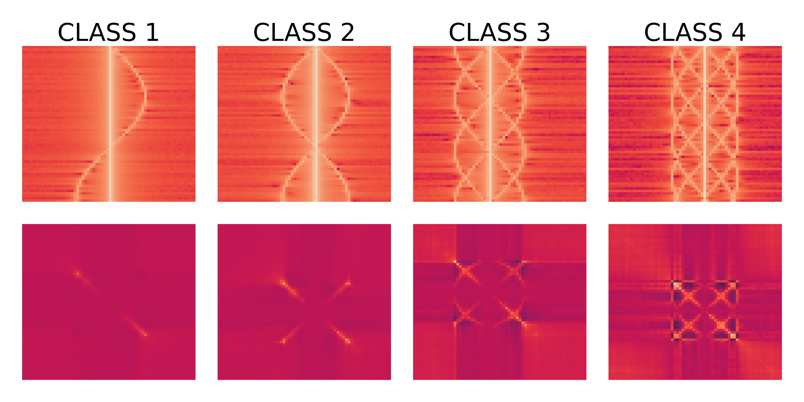

### Repository description

- This repository contains a simple MATLAB simulation code that generates pulse Doppler radar signatures
for four classes of helicopter-like targets. The dataset thus created is used to investigated AD
deep and non-deep methods in a dedicated paper ADD URL. The code of the associated AD experiments is available in this
github repository ADD URL, which also suggests potential extensions of this simulation (use lower Doppler resolution, increase intra and inter-class diversity, etc).
- These scripts were directly inspired by MATLAB examples, 
notably https://fr.mathworks.com/help/radar/ug/introduction-to-micro-doppler-effects.html and https://fr.mathworks.com/help/phased/ug/designing-a-basic-monostatic-pulse-radar.html.
- To generate the samples used in the companion repository and paper, launch the script `generate_target_dataset.m`. You need to create a `data/` folder in the code directory beforehand, the
files created by the simulation will be stored in `data/` by `target.m`.

If you found this code useful, please consider citing the paper:

ADD PAPER REFERENCE

### License

MIT